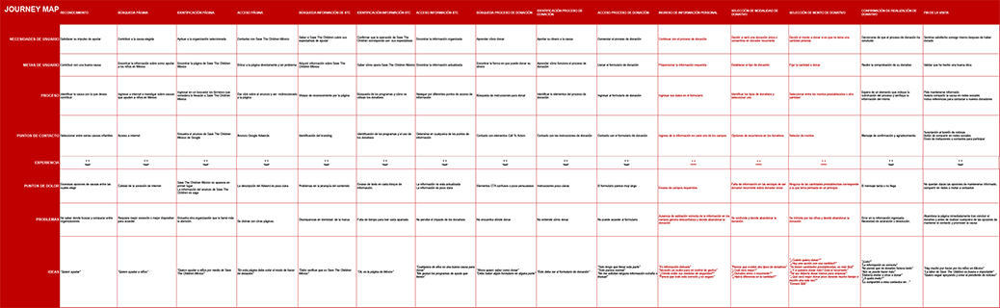

# SAVE THE CHILDREN MÉXICO

* **Track:** _UX Specialization_
* **Sprint 05:** _UX PROCESS_

## OBJETIVO:

** Elevar el radio de conversión de visitantes a donadores que llegan a la landing page de Save The Children México a través de la publicidad pagada en GoogleAds. **

### EQUIPO

  ** Tania Sosa **
    *UX Researcher*

  ** Karina Quesada **
    *UX Researcher*

  ** Jazmin López **
    *UX Researcher*

  ** Carmen Vega **
    *UX Designer*

  ** Adriana Dillarza **
    *UX Designer*

  ** Elzbeth Blanco **
    *Product Owner*

### OBJETIVO DE NEGOCIO

Para comprender mejor la naturaleza del desafío se elaboró un Business Canvas de Save The Children que nos permitiera identificar mejor los aspectos de negocio de la organización.

-----------------------------------------------------------------------------------------------------------------------------------------------------------

### SWOT

Este análisis nos ayudo a identificar los puntos en los que deberiamos enfocarnos para mejorar el punto de percepción del público hacia Save The Children y así resolver mejor el problema.

-----------------------------------------------------------------------------------------------------------------------------------------------------------
### PESTEL

La ventaja que nos presentó el realizar este análisis es poder expandir nuestra visión del entorno en el que se mueve la organización, su alcance y también sus limitantes.

-----------------------------------------------------------------------------------------------------------------------------------------------------------

### MAPA DE EMPATÍA

Al tratarse de una organización que representa una causa de fines altruistas era muy importante para nuestro objetivo comprender los sentimientos que podían tener nuestros usuarios e identificar aquellos que influyeran en la conclusión o abandono de sus tareas dentro de la página.

-----------------------------------------------------------------------------------------------------------------------------------------------------------

### USER PERSONA

Cada miembro del equipo elaboró un perfil de usuario basados en los datos que nos proporciono Save The Children sobre donadores actuales y a partir de ellos se selecciono uno que representara al mayor número de usuarios provenientes del canal de GoogleAds.

-----------------------------------------------------------------------------------------------------------------------------------------------------------

### CUSTOMER JOURNEY MAP

Con el user persona seleccionado se realizó un journey map que nos permitiera identificar el área de mayor riesgo para que el usuario abandonara su tarea y en este caso pudimos concluir que era en el llenado del formulario de donación.

-----------------------------------------------------------------------------------------------------------------------------------------------------------

### ANÁLISIS DE PARETO

Una vez identifcados los pain points de nuestros usuarios, procedimos a realizar una análisis de pareto en cada punto para poder llegar a lo que consideramos la raíz de cada uno de esos problemas, identificar si había coincidencias entre las causantes y así poder resolver el mayor número de incidencias con el menor número de implementaciones.

-----------------------------------------------------------------------------------------------------------------------------------------------------------

### OBJETIVOS SMART

Con nuestras propuestas de soluciones reelaboramos el planteamiento de los objetivos smart que nos llevaran a situaciones donde pudieramos medir los resultados de nuestra propuesta de forma real y especifica.

-----------------------------------------------------------------------------------------------------------------------------------------------------------

### FUNNEL DE CONVERSIÓN

Decidimos desarrollar un embudo de conversión enfocado en 4 puntos:

  - Atraer donadores potenciales
  - Convertir los visitantes en donadores
  - Convertir los donadores en donadores recurrentes
  - Convertir a todos los donadores en promotores de la causa para atraer nuevos donadores potenciales.

### PROPUESTA  

Por todo lo anterior nuestras propuestas de soluciones son:

  - Redición del copy del anuncio en GoogleAds
  - Establecimiento de un sistema de diseño para todas las páginas
  - Rediseño de landing page con énfasis en el formato de formulario de donación haciendo su aparición hasta que es invocado por el usuario a través de un botón y acortando el número de pasos para su llenado.
  - Mensaje instantaneo de agradecimiento al usuario una vez que ha concluido el proceso de donación.
  - Modificiación en el discurso de imágenes al cambiarlas por aquellas que muestren a los niños en actitudes y actividades positivas dentro de un entorno mejorado gracias a los programas.
  - Sintesis de la línea de tiempo de la historia de Save The Children.
  - Inclusión de testimoniales de donadores y beneficiarios.
  - Resalte de las empresas más importantes que respaldan actualmente a la organización.
  - Creación de de una app movil complementearia para el programa Defensores de la niñez con el objetivo de acelerar las donaciones de los usuarios recurrentes y promover entre ellos un sentimimiento de comunidad que los inspire e impulse a convertirse en portavoces de la causa y atraer nuevos donadores.

-----------------------------------------------------------------------------------------------------------------------------------------------------------
### METODOLOGÍAS EMPLEADAS PARA OBTENER INFORMACION SOBRE LA ORGANIZACION Y NUESTROS USUARIOS

  - Análisis SWOT
  - Análisis PESTEL
  - Investigación de gabinete
  - Sesión de preguntas y respuestas a nivel grupal con personal de la organización
  - Sesión de preguntas y respuestas como equipo con personal de la organización
  - Diseño y levantamiento de encuesta dirigida al público segmentado por save the children méxico
  - Mapa de empatía
  - Creación de user personas
  - Creación de customer journey map

-----------------------------------------------------------------------------------------------------------------------------------------------------------

### INSIGHTS

Entre los resultados de las investigaciones anteriores destacaron los siguientes puntos que nos llevaron a tomar resoluciones en cuanto a nuestra propuesta:

  - Los usuarios encuentran inspiradora la labor de Save The Children
  - Una gran parte de los usuarios siente incomodidad al preguntarle sus datos sin mostrar mayor información del proceso de donación
  - El punto en el que la mayoría presenta resistencia o desiste por completo de la tarea de donación es en el llenado del formulario
  - Nuestros usuarios opinaron que desearían ver imágenes más positivas de los niños
  - Para los usuarios es importante sentir cómo impacta su donativo en la vida de los pequeños.

-----------------------------------------------------------------------------------------------------------------------------------------------------------

### SOLUCIONES

  - ** BACKLOG **

  - ** SKETCH. **

  - ** LANDING PAGE. **

** Es importante remarcar que no se entregó un prototipo, sino una página completa con funcionalidad y además con la integración de herramientas como Google Analytics, Hubspot y Hotjar facilitando su uso para establecer y obtener métricas que permitan la optimización constante del proyecto. **

  - ** SISTEMA DE DISEÑO **

  - ** WIREFRAME APP DEFENSORES DE LA NIÑEZ. **

-----------------------------------------------------------------------------------------------------------------------------------------------------------

### EXTRAS

Con el ánimo de no solo mejorar la captación de visitantes en la landing page sino tambien colaborar haciendo más fácil la implementación de nuestras soluciones y el trabajo futuro de los miembros de la organización decidimos apoyarles incluyendo:

  - Programa Mobirise
  - Checklist de SEO
  - Checklist de Usabilidad
  - Checklist de Accesabilidad
  - Imagen de los resultados del checkup de SEO frente a la competencia
  - Listado de buenas prácticas

-----------------------------------------------------------------------------------------------------------------------------------------------------------

### CONCLUSIONES

Nos sentimos satisfechas de haber participado con una organización tan reconocida y con una causa tan noble como Save The Children México.

Estamos convencidas que la implementación de nuestras soluciones incrementará la satisfacción de los usuarios, lo que los motivará a elevar el número de aquellos que se conviertan no solo en donadores sino en donadores recurrentes e incluso promotores voluntarios de la causa.

Agradecemos esta oportunidad y esperamos seguir colaborando a más causas y usuarios felices.

# SAVE THE CHILDREN
** LABORATORIA 2018 **

-------------------------------------------------------
